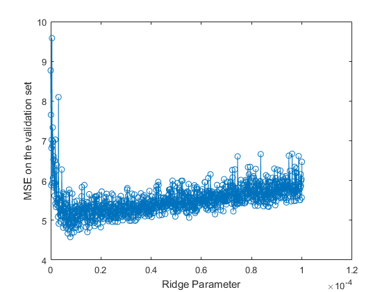

<html>
<body>
<style>
  ul {list-style-type: none; 
    padding: 0; 
    margin: 0; 
    height: 100%; 
    position: fixed;
    left:17px;
    top:17%;}
</style>

<ul> 
  <font size="4.7">
  <li><a href="ridge_regression.html">
  <p style="color:#000000;background-color:#FFD700">**Introduction**</p></a></li> 
  <li><a href="Matlab.html">
  <p style="color:#000000;background-color:#6495ED">**Matlab**</p></a></li>
  <li><a href="Stata.html">
  <p style="color:#000000;background-color:#FFD700">**Stata**</p></a></li> 
  <li><a href="Project_R.html">
  <p style="color:#000000;background-color:#6495ED">**R**</p></a></li>
  </font>
</ul>

</body>
</html>


##Data Import
The meatspec data comes from R(faraway), first we import it into Matlab, and split the reponse **fat***(215x1)* and predictors **spec***(215x100)*. 
```{r dataimport, echo=TRUE, eval=FALSE}
M = csvread('meatspec.csv',1);
fat = M(:,101);
spec = M(:,1:100);
```

Since the data are clean, we don't need to do much work about the data cleaning. Let's place more effort on the model analysis part. 


##Ridge Regression
#$\beta$<sub>*Ridge*
In Matlab, we quickly can get the coefficient of ridge regression with the help of function **b=ridge(y,X,k,scaled)**. As we know, the ridge regression will perform better if we standardize the data before doing the regression. So the **ridge()** function in Matlab,by default, will always stardarize the data first. And the fouth parameter scaled means whether we choose to transform the coefficient $\beta$ in to the scale of the original data.

Let's take a look at how it works on our data. 

```{r betaRidge, echo=TRUE, eval=FALSE}
b = ridge(fat,spec,lamda,1)
```

The Ridge trace shows a set of ridge solutions. And it can show us more directly how the coefficient $\beta$ change with $\lambda$. With each ridge parameter, we can find the related coefficient. Since in the meatspec data we use has 100 predictors, which means there are 100 ridge traces, making the plots looks a little messy. 
```{r Ridgetrace, echo=TRUE, eval=FALSE}
figure
plot(lamda,b,'LineWidth',2)
ylim([-100 100])
grid on
xlabel('Ridge Parameter')
ylabel('Standardized Coefficient')
title('{\bf Ridge Trace}')
```
{#id.class height=350px}

##$\lambda$ Selection
One of the most important part of ridge regression is to select a good $\lambda$ to help the model performance.  

In the original paper of *Hoerl* and *Kennard* , they thought we could choose $\lambda$ for which coefficients are not rapidly 
changing and have "sensible" signs. Since it's not a disciplined way, the standard practice now is use cross-validation.

###Cross-validation
In Matlab, we can finish the cross-validation work of $\lambda$ selection with the help of **crossval()** function. In **R** and **Stata**, we can directly select the $\lambda$ with which could reach the minimum the generalized cross-validation value (*GCV*) on the validation set. While in Matlab, we can not directly get the GCV value, so we set the $\lambda$ choosing criterion of MSE on validation set, which is also very interpretable and commonly used.
```{r Crossvalidation, echo=TRUE, eval=FALSE}
i=1
for lamda=0:1e-10:3e-8
ridgef=@(XTRAIN,ytrain,XTEST)([ones(min(size(XTEST)),1) XTEST]*ridge(ytrain,XTRAIN,lamda,0));
cvMse(:,i) = crossval('mse',spec,fat,'predfun',ridgef,'kfold',10)
i=i+1
end
[B,I]=min(cvMse)
```
Run the code, we can get the $\lambda$=7.3e-9, *MSE*=5.219 on the validation set.

{#id.class height=350px}


From the plot above, we can abserve fluctuation between the $\lambda$ and MSE value, more things should be considered to find the possible reasons. 

##Unsolved problem and Possible solutions##
In this case, when we use the crossvalidation to choose the $\lambda$, $\lambda$ would fluctuate and can not always get a convergence answer, although the *MSE* calculated on the validation set is quite stable. 

There are several possible reaons. 

1. Since the $\lambda$ in our datasets is relatively small, on the scale of 0~2e-8, so the relatively small value of $\lambda$ could be the reason of fluctuation. And since the *MSE* calculated on the validation set remain stable, $\lambda$'s fluctuation could not cause much problem.

2. I choose the $\lambda$  with the critetion of *MSE*, maybe GCV will make the $\lambda$  selection perform more stable.

##Model test
###Compared with OLS method
