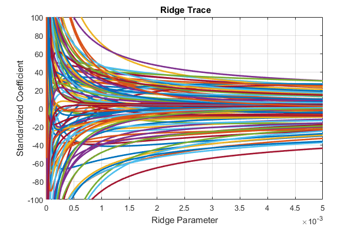
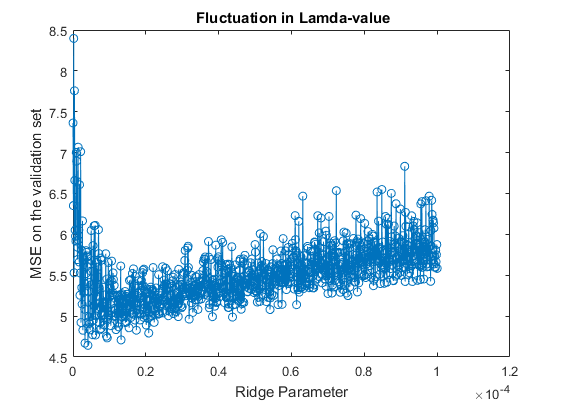
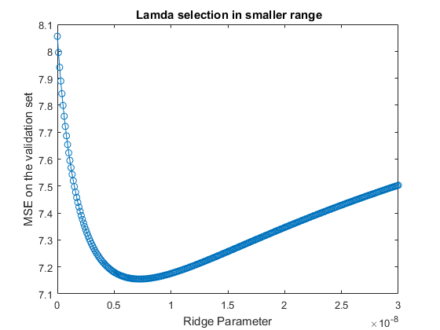

<html>
<body>
<style>
  ul {list-style-type: none; 
    padding: 0; 
    margin: 0; 
    height: 100%; 
    position: fixed;
    left:17px;
    top:17%;}
</style>

<ul> 
  <font size="4.7">
  <li><a href="ridge_regression.html">
  <p style="color:#000000;background-color:#FFD700">**Introduction**</p></a></li> 
  <li><a href="Matlab.html">
  <p style="color:#000000;background-color:#6495ED">**Matlab**</p></a></li>
  <li><a href="Stata.html">
  <p style="color:#000000;background-color:#FFD700">**Stata**</p></a></li> 
  <li><a href="Project_R.html">
  <p style="color:#000000;background-color:#6495ED">**R**</p></a></li>
  </font>
</ul>

</body>
</html>


#**Tutorial to Ridge Regression**

##SVD

The computation of ridge coefficients is equivalent to a *argmin* function as below. 
\[\beta=arg\min \limits_{x\in R}||X\beta-Y||^{2}_{2}+\lambda||\beta||^{2}_{2} \]
Then we can find this function can be rewrite as a clearer way as below.

\[\beta=arg\min \limits_{x\in R} || 
\left( 
\begin {matrix} 
 X\\
 \sqrt{\lambda}I\\
 \end {matrix}
 \right)
\begin {matrix} 
 \beta\\
 \end {matrix}
 -
\left( 
\begin {matrix} 
 Y\\
 0\\
 \end {matrix}
 \right)
||^{2}_{2}
\]

From the view of singular value decomposition(**SVD**), we can quickly get the answer to the question of $X=argmin||AX-b||^{2}_{2}=A^{+}b$, where $A^{+}$ means the pseudo inverse of A matrix. Then we can compute the pseudo inverse of the matrix of our problem and get the answer of ridge coefficients \beta.

\[\beta=
\left( 
\begin {matrix} 
 X\\
 \sqrt{\lambda}I\\
 \end {matrix}
 \right)^{+}
\left( 
\begin {matrix} 
 Y\\
 0\\
 \end {matrix}
 \right)
=
\left[
\left( 
\begin {matrix} 
 X\\
 \sqrt{\lambda}I\\
 \end {matrix}
 \right)^{T}
\left( 
\begin {matrix} 
 X\\
 \sqrt{\lambda}I\\
 \end {matrix}
 \right)
\right]^{-1}
\left(
\begin{matrix}
X^{T}&\sqrt{\lambda}I
\end{matrix}
\right)
\left( 
\begin {matrix} 
 Y\\
 0\\
 \end {matrix}
 \right)
\]

Finish the computation above and we can get the value of $\beta$ equals
\[
\beta=(X^{T}X+{\lambda}I)^{-1}X^{T}Y
\]
Now we briefly introduce how to compute the regression coeficients. In the following part, we'll place more efforts in $\lambda$ selection's work, which is equally an important part in ridge regression.


##Load data 
The meatspec data comes from R(faraway), first we import it into Matlab, and split the reponse **fat***(215x1)* and predictors **spec***(215x100)*. 
```{r dataimport, echo=TRUE, eval=FALSE}
M = csvread('meatspec.csv',1);
fat = M(:,101);
spec = M(:,1:100);
```


Since the data are clean, we don't need to do much work about the data cleaning. Let's place more effort on the model analysis part. 


##Ridge Regression
#$\beta$<sub>*Ridge*
In Matlab, we can quickly get the coefficient of ridge regression with the help of function **b=ridge(y,X,k,scaled)**. As we know, the ridge regression will perform better if we standardize the data before doing the regression. So the **ridge()** function in Matlab,by default, will always stardarize the data first. And the fouth parameter scaled means whether we choose to transform the coefficient $\beta$ in to the scale of the original data.

Let's take a look at how it works on our data. 

```{r betaRidge, echo=TRUE, eval=FALSE}
b = ridge(fat,spec,lamda,1)
```

The Ridge trace shows a set of ridge solutions. And it can show us more directly how the coefficient $\beta$ change with $\lambda$. With each ridge parameter, we can find the related coefficient. Since in the meatspec data we use has 100 predictors, which means there are 100 ridge traces, making the plots looks a little messy. 
```{r Ridgetrace, echo=TRUE, eval=FALSE}
figure
plot(lamda,b,'LineWidth',2)
ylim([-100 100])
grid on
xlabel('Ridge Parameter')
ylabel('Standardized Coefficient')
title('{\bf Ridge Trace}')
```
{#id.class height=350px}

##$\lambda$ Selection
One of the most important part of ridge regression is to select a good $\lambda$ to help the model performance.  

In the original paper of *Hoerl* and *Kennard* , they thought we could choose $\lambda$ for which coefficients are not rapidly 
changing and have "sensible" signs. Since it's not a disciplined way, the standard practice now is use cross-validation.

###Cross-validation
In Matlab, we can finish the cross-validation work of $\lambda$ selection with the help of **crossval()** function. In **R** and **Stata**, we can directly select the $\lambda$ with which could reach the minimum the generalized cross-validation value (*GCV*) on the validation set. While in Matlab, we can not directly get the GCV value, so we set the $\lambda$ choosing criterion of MSE on validation set, which is also very interpretable and commonly used.

First, we split our dataset into test set and validation set. We choose the test set as the row numbers which mod 5=0, and the left as the validation set. 
```{r split dataset, echo=TRUE, eval=FALSE}
index0 = find(mod([1:172],5)==0)
index1 = find(mod([1:172],5)>0)
Mtest = M(index0,:);fatv=Mvalidation(:,101);specv = Mvalidation(:,1:100); %split the test set
Mvalidation= M(index1,:);fatt=Mtest(1:100);spect=Mtest(:,1:100) %split the validation set
```

Then we finish the cross-validation on our validation set.
```{r Crossvalidation, echo=TRUE, eval=FALSE}
i=1
cp=cvpartition(fat,'k',10); %set dataset partition && set k-fold numbers =10
for lamda=0:1e-7:10e-5
ridgef=@(XTRAIN,ytrain,XTEST)([ones(min(size(XTEST)),1) XTEST]*ridge(ytrain,XTRAIN,lamda,0));
cvMse(:,i) = crossval('mse',spec,fat,'predfun',ridgef,'partition',cp)
i=i+1
end
[B,I]=min(cvMse) % select lamda =1.18e-5, with MSE=5.1894
lamda=0:1e-7:10e-5
plot(lamda,cvMse,'o-')
xlabel('Ridge Parameter')
ylabel('MSE on the validation set')
```

{#id.class height=350px}

Run the code, we can get the $\lambda$=1.18e-5, *MSE*=5.1894 on the validation set. Note that due to the randomness of the function **cvpartition()**, which is used to set partition of the k-fold cross-validation, the result may vary, but only changes in a small scale.

###Results Comparison and Reflection
One of the most important work in Ridge regression is to select $\lambda$. But when we compare the results we get from **Matlab, R , Stata**, it's somewhat upsetteing to find the results differs at first $\lambda_{Matlab}$ =1.18e-5, $\lambda_{R}$ =1.81e-9, $\lambda_{Stata}$=5e-10. But explore the reason for such difference, we find it arises from some interesting reasons. 

####(i)Different cross-validation partitions lead to difference
We can observe obvious fluctuation between the $\lambda$ and MSE value, if we do not set cross-validation's partitions before we loop for different $\lambda$ value. The general trend of plot doesn't change but with the fulctuation in $\lambda$. We can see that different partitions in cross-validation would lead to different results.  

{#id.class height=350px}

####(ii)Try another lamda-selection's range
If we retrict the range for lamda selection in loop [0,1e-10,3e-8] instead of the loop I used above [0:1e-7:10e-5], we can select $\lambda$=7.3e-9 with MSE=7.1551, which is quite near the results we get from R and Stata. 

{#id.class height=350px}

Since the $\lambda$ selected with our datasets is relatively small, on the scale of 0~2e-5,, so the relatively small value of $\lambda$ could be the reason of fluctuation. And since the *MSE* calculated on the validation set remain stable, $\lambda$'s fluctuation could not cause much problem.

####(iii)Softwares' relatively different ways to compute
Another reason for difference in selecting $\lambda$ is Matlab, R, Stata use somewhat different ways for such selection. In **Matlab**, there is no function can directly get the $\lambda$, so I combine the loop for $\lambda$ and cross-validation function to get the $\lambda$ with least MSE in validtaion set. In **R**, Ridge package combine the PCA with ridge regression and runs a default way for cross-validation and then get $\lambda$. In **Stata**, the $\lambda$ is selected by the criterion of GCV(*generalized crossvalidation value*) instead of MSE.

##Model test

Use the $\lambda$=1.18e-5, which we get from above. We can finally test the results on the test data. 
```{r Model test, echo=TRUE, eval=FALSE}
index0 = find(mod([1:172],5)==0)
Mtest= M(index0,:);fatt=Mtest(:,101);spect=Mtest(:,1:100) %split the validation set

beta=ridge(fatt,spect,1.18e-5,0) % ridge coefficients
mean((fat-[ones(length(spec),1),spec]*beta).^2) % MSE one the test data
```

Run the code above, we can get the MSE=7.78, which change not much from the validation test (MSE=5.1894). This shows our model still behave well in the test part.