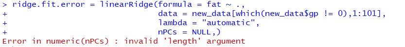

#**Tutorial to Ridge Regression**
<html>
<body>
<style>
  ul {list-style-type: none; 
    padding: 0; 
    margin: 0; 
    height: 100%; 
    position: fixed;
    left:17px;
    top:17%;}
</style>

<ul> 
  <font size="4.7">
  <li><a href="ridge_regression.html">
  <p style="color:#000000;background-color:#FFD700">**Introduction**</p></a></li> 
  <li><a href="Matlab.html">
  <p style="color:#000000;background-color:#6495ED">**Matlab**</p></a></li>
  <li><a href="Stata.html">
  <p style="color:#000000;background-color:#FFD700">**Stata**</p></a></li> 
  <li><a href="Project_R.html">
  <p style="color:#000000;background-color:#6495ED">**R**</p></a></li>
  </font>
</ul>

</body>
</html>

```{r setup, include=FALSE}
# 80: --------------------------------------------------------------------------
#! We generally don't need to see the code in the results document.
knitr::opts_chunk$set(echo = FALSE)

#! Make sure all chunks have a label. This one is labelled 'setup'.
setwd("C:/Users/zhang/Desktop/UMich F18/STATS 506/Project/")


# load packages
if (!require("knitr")) {
  install.packages('knitr')
  library("knitr")
}


if (!require("dplyr")) {
  install.packages('dplyr')
  library("dplyr")
}

```

# Package RIDGE: There is a BUG!
Package RIDGE was published on July 26, 2018.

This package was an implementation of a semi-automatic method to guide the choice of ridge parameter in ridge regression by Erika Cule and Maria De Iorio. The method was based on controlling the variance of the predicted observations in the model. 

While exploring the RIDGE package, we have found an implementation defect in function "linearRidge". 

In this section, we will identify the problem and propose a solution to get rid of it. 

## Load, Mung and Visualize Data: 
The dataset we use was "meatspec", from faraway package. 
```
library("faraway")
data(meatspec)
```

```{R Load Data , include = F}
if (!require("faraway")) {
  install.packages('faraway')
  library("faraway")
}

data(meatspec)
```

Below is a matplot of absorbances(y) agains 100 channel spectrums ($X_1$, $X_2$, ..., $X_{100}$) for first 10 observations in the dataset. 
```{R First 10}
# plot first 10 observations
matplot(t(meatspec[c(1:10), c(1:100)]), 
        pch = "*", las = 1,
        xlab = "channel",
        ylab = "absorbances")
```

To split dataset into 5 groups, a new column "gp" was added with values 0, 1, 2, 3, 4. We take gp = 1 - 4 as training data, and gp = 0 as validation data. 
```
new_data = meatspec %>% dplyr::mutate(gp = seq(1:n())%% 5)
```

```{R new_data, include = F}
new_data = meatspec %>% dplyr::mutate(gp = seq(1:n())%% 5)
```
## Ridge regression using package: RIDGE
### Function: linearRidge
The R package "Ridge" contains a function "linearRidge", which fits a linear ridge regression model providing an option to chose the ridge regression parameter automatically using the method proposed by Cule et at(2012).
```
library("ridge")
```
```{R ridge package, include = F}
if (!require("ridge")) {
  install.packages('ridge')
  library("ridge")
}
```

### Error?!
With our training dataset, calling function linearRidge returns an error as below. 



### Source of error
Tracing back to the source code, the behavior starts deviating from our expection since line 96, where object "nPCs" turned NULL. 

In line 96, "nPCs <- which.max(propVar[propVar < 90]) + 1", function "which.max" returned NULL and assigned it to "nPCs".


### Why NULL?
"nPCs" stands for number of principal component. In source code, "nPCs" is defined as the minimum number of principal components that explains more than **90%** of variances in the predictors.

Using our training data, we have one principle component explains **99.96%** of total variances in the predictors due to collinearity. Since it exceeded the 90% threshold, **we expect setting "nPCS" as 1 here.** 
```
X = new_data[which(new_data$gp != 0),1:100]
Xs = svd(X)
Xs_d2 = Xs$d^2
Xs_v = cumsum(Xs_d2) / sum(Xs_d2)
min(Xs_v)
plot(Xs_v, xlab = "Index_PC", ylab = "Variances")
```
```{R svd}
X = new_data[which(new_data$gp != 0),1:100]
Xs = svd(X)
Xs_d2 = Xs$d^2
Xs_v = cumsum(Xs_d2) / sum(Xs_d2)
min(Xs_v)
par(mar = c(7,7,5,5))
plot(Xs_v, xlab = "Index_PC", ylab = "", las = 1)
mtext(text = "Variances", side = 3, line = 1, at = -13)

```

**Why "nPCs" is NULL but not 1?** This is because function "which.max" determines the location, i.e., index of the first maximum of a numeric vector. In our case, we were not able to find such a location, thus NULL is returned. "nPCs"was assigned as NULL as well. 


### Our Solution
In case of almost perfect multicollinearity, we propose to calculate Singular value decomposition separately and specify your own "nPCs."

Meanwhile, you can choose your own threshold and reflect it by setting "nPCs" value.

Instead of relying on the 90% threshold set within the function, more flexibility is granted for users in this way. 

### Fit linear ridge regression with nPCs = 1

Based on training data, we fit linear lasso regression using function "linearRidge", which returns an object containing a named vector of fitted coefficients, the ridge regression parameters($\lambda$), etc..
```
train_data = new_data[which(new_data$gp != 0),1:101]
ridge.fit1 = linearRidge(formula = fat ~ ., 
                         data = train_data,
                         nPCs = 1)
ridge.fit1.summary = summary(ridge.fit1)
ridge.fit1.summary$lambda
```
```{R ridge.fit}
train_data = new_data[which(new_data$gp != 0),1:101]
ridge.fit1 = linearRidge(formula = fat ~ ., 
                        data = train_data,
                        nPCs = 1)
ridge.fit1.summary = summary(ridge.fit1)

ridge.fit1.summary$lambda


```


#### Prediction 
For validation, we use the function "predict" with object returned by "linearRidge" and our validation data. The RMSE calculated based on prediction was about 10.
```
test_data = new_data[which(new_data$gp == 0),1:101]
ridge.predict1 = predict(object = ridge.fit1, newdata = test_data[, 1:100])

rmse_fct = function(y, yhat){
  sqrt(mean( (y - yhat)^2))
}


rmse_fct(y = test_data[, 101],
         yhat = ridge.predict1)
```

```{R prediction, include = TRUE}
test_data = new_data[which(new_data$gp == 0),1:101]
ridge.predict1 = predict(object = ridge.fit1, newdata = test_data[, 1:100])

rmse_fct = function(y, yhat){
  sqrt(mean( (y - yhat)^2))
}

rmse_fct(y = test_data[, 101],
         yhat = ridge.predict1)
```

### Fit linear ridge regression with nPCs = 3
What will happen if we set a higher threshold? Let's consider including first 3 principal components by setting nPCs = 3. Based on previous analysis, first 3 principal components explains more than **99.99%** variances in the predictors. 

```
train_data = new_data[which(new_data$gp != 0),1:101]
ridge.fit3 = linearRidge(formula = fat ~ ., 
                         data = train_data,
                         nPCs = 1)
ridge.fit3.summary = summary(ridge.fit)

ridge.fit3.summary$lambda
```
```{R ridge.fit 3}
train_data = new_data[which(new_data$gp != 0),1:101]
ridge.fit3 = linearRidge(formula = fat ~ ., 
                         data = train_data,
                         nPCs = 50)
ridge.fit3.summary = summary(ridge.fit3)

ridge.fit3.summary$lambda
```


#### Prediction 
For validation, we use the function "predict" with object returned by "linearRidge" and our validation data. The RMSE calculated based on prediction was about 4.3, which is much smaller than setting nPCs = 1. **Better prediction!**
```
test_data = new_data[which(new_data$gp == 0),1:101]
ridge.predict3 = predict(object = ridge.fit3, newdata = test_data[, 1:100])

rmse_fct(y = test_data[, 101],
         yhat = ridge.predict3)
```

```{R prediction 3, include = TRUE}
test_data = new_data[which(new_data$gp == 0),1:101]
ridge.predict3 = predict(object = ridge.fit3, newdata = test_data[, 1:100])

rmse_fct(y = test_data[, 101],
         yhat = ridge.predict3)
```

### nPCs: the larger the better?
What will happen if we set an even higher threshold? Do we really need a threshold?
Let's consider including first 80 principal components by setting nPCs = 80.

```
train_data = new_data[which(new_data$gp != 0),1:101]
ridge.fit80 = linearRidge(formula = fat ~ ., 
                         data = train_data,
                         nPCs = 80)
ridge.fit80.summary = summary(ridge.fit80)
ridge.fit80.summary$lambda
```
```{R ridge.fit 80}
train_data = new_data[which(new_data$gp != 0),1:101]
ridge.fit80 = linearRidge(formula = fat ~ ., 
                         data = train_data,
                         nPCs = 80)
ridge.fit80.summary = summary(ridge.fit80)

ridge.fit80.summary$lambda
```


#### Prediction 
For validation, we use the function "predict" with object returned by "linearRidge" and our validation data. The RMSE calculated based on prediction was about 4.7, which is larger than setting nPCs = 3. **Thus including more principle components does not guaranteee better prediction. **  
```
test_data = new_data[which(new_data$gp == 0),1:101]
ridge.predict80 = predict(object = ridge.fit80, newdata = test_data[, 1:100])

rmse_fct(y = test_data[, 101],
         yhat = ridge.predict80)
```

```{R prediction 80, include = TRUE}
test_data = new_data[which(new_data$gp == 0),1:101]
ridge.predict80 = predict(object = ridge.fit80, newdata = test_data[, 1:100])

rmse_fct(y = test_data[, 101],
         yhat = ridge.predict80)
```
## Conclusion 
We identified a defect in implementating "linearRidge" function in package "RIDGE" under extreme scenarios, where predictors are almost perfectly multicollinearity. Under such situations, we suggest user to to specify the value of paramter "nPCs" as an input to the function. 

Zooming into the source code, we observed the threshold used for selecting number of principal components was fixed at 90%. Is it the best practice? Based on our data, the answer is no. Moreover, higher number of principal components does not guarantee better prediction. 

Here we come to problems may worth further investigation: where is the optimal point for threshold? How to find it efficiently? 
