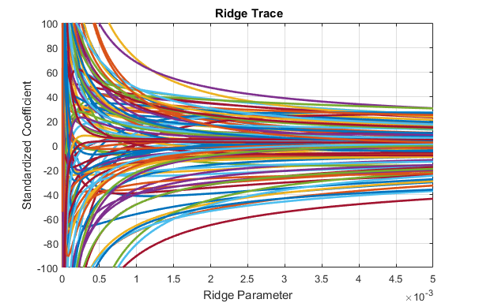
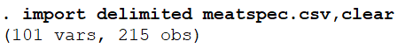
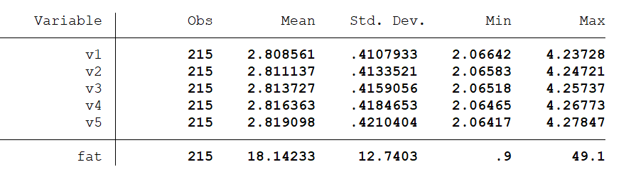
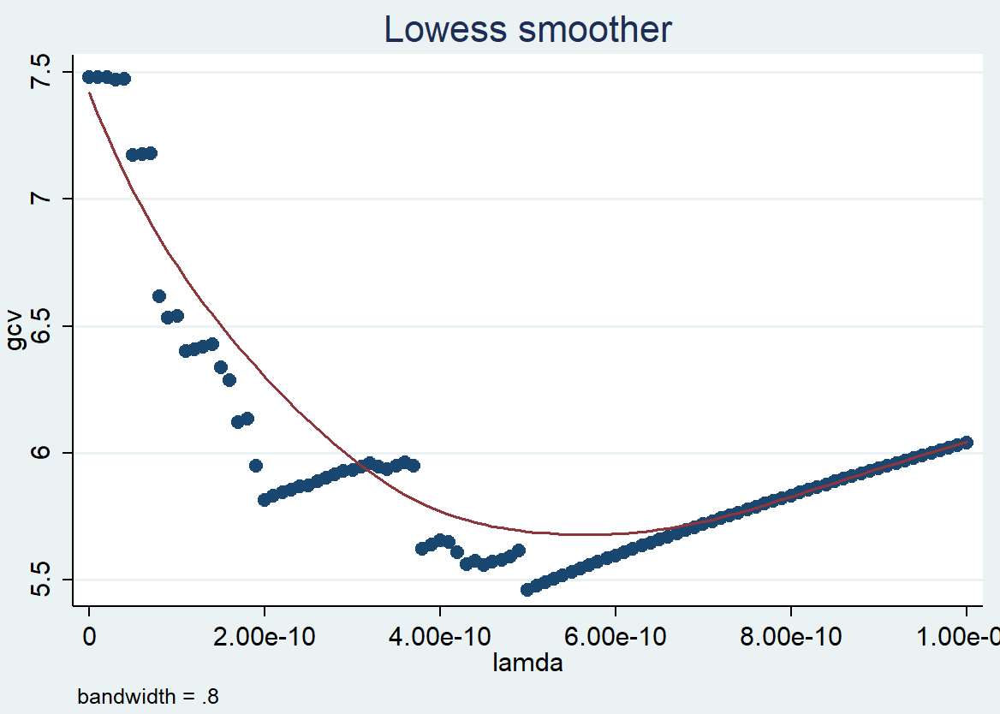
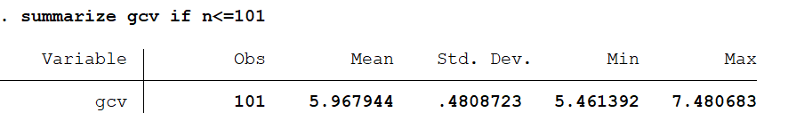
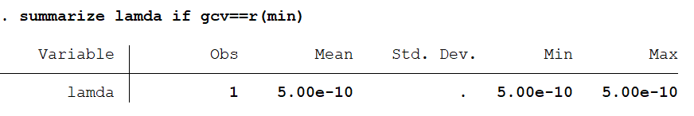
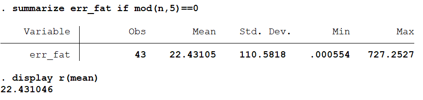
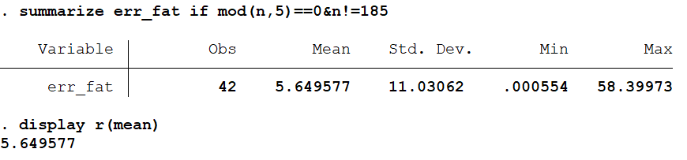

```{r setup, include=FALSE}
# 80: --------------------------------------------------------------------------
knitr::opts_chunk$set(echo = TRUE)
library(faraway)
library(fields)
library(dplyr)
library(ridge)
```

<font size="6.7">
**Tutorial to Ridge Regression**
  </font>
  

#Introduction
By ordinary OLS regression, it is easy to cause problems, for example, imprecise 
estimate of coefficients, measurement error sensitivity and numerical instability 
, when predictors are highly correlated. To deal with multiple collinearity of 
predictors, we could use ridge regression instead.

First, let's take a look at how regression coefficients $\beta$ is computed.
The computation of ridge coefficients is equivalent to a *argmin* function as below. 
\[\beta=argmin ||X\beta-Y||^{2}_{2}+\lambda||\beta||^{2}_{2} \]
Then we can find this function could be rewritten as a clearer way as below.

\[\beta=argmin || 
\left( 
\begin {matrix} 
 X\\
 \sqrt{\lambda}I\\
 \end {matrix}
 \right)
\begin {matrix} 
 \beta\\
 \end {matrix}
 -
\left( 
\begin {matrix} 
 Y\\
 0\\
 \end {matrix}
 \right)
||^{2}_{2}
\]

From the view of singular value decomposition(**SVD**), we can quickly get the 
answer to the question of $X=argmin||AX-b||^{2}_{2}=A^{+}b$, where $A^{+}$ means 
the pseudo inverse of $A$ matrix. Consequently, we could obtain ridge 
coefficients \beta by calculating the pseudo inverse of matrix 
$\left(\begin {matrix} X\\ \sqrt{\lambda}I\\ \end {matrix}\right)$
in our problem.

\[\beta=
\left( 
\begin {matrix} 
 X\\
 \sqrt{\lambda}I\\
 \end {matrix}
 \right)^{+}
\left( 
\begin {matrix} 
 Y\\
 0\\
 \end {matrix}
 \right)
=
\left[
\left( 
\begin {matrix} 
 X\\
 \sqrt{\lambda}I\\
 \end {matrix}
 \right)^{T}
\left( 
\begin {matrix} 
 X\\
 \sqrt{\lambda}I\\
 \end {matrix}
 \right)
\right]^{-1}
\left(
\begin{matrix}
X^{T}&\sqrt{\lambda}I
\end{matrix}
\right)
\left( 
\begin {matrix} 
 Y\\
 0\\
 \end {matrix}
 \right)
\]

Finishing these steps above, we can get the value of coefficients $\beta$, which equals
\[
\beta=(X^{T}X+{\lambda}I)^{-1}X^{T}Y
\]
Thus, we briefly introduced the process of computing ridge regression coeficients. In the 
following part, we'll place most of our efforts on selection of $\lambda$, which is 
an equally important part in ridge regression.


#Data Description
The dataset we will use in this project is [meatspec](https://cran.r-project.org/web/packages/faraway/faraway.pdf), from R package: faraway. You could
see more descriptions of this package in references.

The dataset meatspec includes 215 samples. For each sample, the fat content(fat) of fresh
choped meat was measured along the 100 channel spectrum of absorbances(V1-V100). 
Since determining the fat content via analytical chemistry is time consuming, we would 
like to build a model to predict the fat content of new samples using 100 absorbances 
which can be measured more easily.

```{R dim, include = T}
##Source of data
library(faraway)
data("meatspec")
```

```{r table,echo=FALSE}
variable_description=data.frame(c("V1-V100","fat"),c("absorbances across a range of 100 wavelengths","fat content"),c("numeric","numeric"))
cap='**Table 1.** Description of variables'
knitr::kable(variable_description,format='pandoc',caption=cap,align='l',
             col.names=c("Variables","Description","Class"))
```

The 215 samples of 100 channel spectrum of absorbances measurement forms a 215 * 100
matrix, where the condition number is 2.6e+14. This high condition number shows that the 
variable matrix in our example is ill-conditioned.
```{R conditional number}
##dimension
dim(meatspec)
##condition number
X = as.matrix(meatspec[, -101])
e = eigen(t(X) %*% X)$val
max(e)/min(e)
```

Below is a plot of correlation among 100 channel spectrum of absorbances. We observe 
a very high collinearity, where adjacent channels are almost perfectly correlated. 

<center>
```{R correlation, echo = FALSE}
##correlation plot
par(mar = c(3,3,2,1))
fields::image.plot(cor(X), col = heat.colors(64), las = 1, axes = FALSE)
axis(side = 1, at = seq(0, 100, 10)/100, labels = seq(0, 100, 10))
axis(side = 2, at = seq(0, 100, 10)/100, labels = seq(0, 100, 10), las = 2)
mtext(text = "Channel", side = 1, line = 1, at = 1.1)
```

**Figure 1.** Correlation plot of 100 channel spectrum of absorbances
</center>


As it could be observed above, predictors are highly correlated. So, we are going to 
use ridge regression as we mentioned first. More explicitly, we will do ridge 
regression of response fat on V1-V100 predictors to fit a model and predict the fat 
content in each chopped pure meat. We will show the examples of ridge regression in R, 
Matlab and Stata respectively. See introductions of specific ridge packages or functions below.

# {.tabset}
## R
### Package RIDGE: There is a BUG!
Package RIDGE was published on July 26, 2018.

This package was an implementation of a semi-automatic method to guide the choice 
of ridge parameter in ridge regression by Erika Cule and Maria De Iorio. The method 
was based on controlling the variance of the predicted observations in the model. The 
underlying method is different from those used in our tutorial on Matlab and Stata, thus 
different results are expected and considered acceptable. 

While exploring the RIDGE package, we have found an implementation defect in function "linearRidge". 

In this section, we will identify the problem and propose a solution to get rid of it. 

### Load, Mung and Visualize Data
The dataset we use is "meatspec", from faraway package. 
```
library("faraway")
data(meatspec)
```

```{R Load Data , include = F}
data(meatspec)
```

Below is a matplot of absorbances(y) against 100 channel spectrums 
($X_1$, $X_2$, ..., $X_{100}$) for first 10 observations in the dataset. 
```
# plot first 10 observations
matplot(t(meatspec[c(1:10), c(1:100)]), 
        pch = "*", las = 1,
        xlab = "channel",
        ylab = "absorbances")
```
<center>
```{R First 10, fig.width=6,fig.height=4,echo=FALSE}
matplot(t(meatspec[c(1:10), c(1:100)]), 
        pch = "*", las = 1,
        xlab = "channel",
        ylab = "absorbances")
```

**Figure 2.** Plot of first 10 observations
</center>

####Group
To split dataset into 5 groups, a new column "gp" is added with values 0, 1, 2, 3, 4.  
We take gp = 1 - 4 as training data, and gp = 0 as validation data. 
```
new_data = meatspec %>% dplyr::mutate(gp = seq(1:n())%% 5)
```

```{R new_data, include = F,echo=FALSE}
# split into 5 groups
new_data = meatspec %>% dplyr::mutate(gp = seq(1:n())%% 5)
```

### Ridge regression using package: RIDGE
#### $*$ Function Description: linearRidge
The R package "Ridge" contains a function "linearRidge", which fits a linear ridge 
regression model providing an option to chose the ridge regression parameter 
automatically using the method proposed by Cule in 2012.
```
library("ridge")
```

#### $*$ Error?!
With our training dataset, calling function linearRidge returns an error as below. 

```
# fit ridge regression using linearRidge
```

{width=77%}

```{R error, include = FALSE, eval = FALSE,echo=FALSE}
ridge.fit.error = linearRidge(formula = fat ~ ., 
                              data = new_data[which(new_data$gp != 0), 1:101],
                              lambda = "automatic",
                              nPCs = NULL)
```

#### $*$ Source of error
Tracing back to the source code, the behavior starts deviating from our expection 
since line 96, where object "nPCs" turned NULL. 

In line 96, "nPCs <- which.max(propVar[propVar < 90]) + 1", function "which.max" 
returned NULL and assigned it to "nPCs".

{width=67%}

#### Why NULL?
"nPCs" stands for number of principal component. In source code, "nPCs" is defined 
as the minimum number of principal components that explains more than **90%** of 
variances in the predictors.

Using our training data, we have one principle component explains **99.96%** of 
total variances in the predictors due to collinearity. Since it exceeds the 90% 
threshold, **we expect setting "nPCS" as 1 here.** 
```
# check PC
X = new_data[which(new_data$gp != 0),1:100]
Xs = svd(X)
Xs_d2 = Xs$d^2
Xs_v = cumsum(Xs_d2) / sum(Xs_d2)
min(Xs_v)
plot(Xs_v, xlab = "Index_PC", ylab = "Variances")
```

```{R svd,echo=FALSE}
X = new_data[which(new_data$gp != 0),1:100]
Xs = svd(X)
Xs_d2 = Xs$d^2
Xs_v = cumsum(Xs_d2) / sum(Xs_d2)
min(Xs_v)
```
<center>
```{R svd_plot, echo = FALSE}
par(mar = c(7,7,5,5))
plot(Xs_v, xlab = "Index_PC", ylab = "", las = 1)
mtext(text = "Variances", side = 3, line = 1, at = -13)
```

**Figure 3.** Variance explained by Principle Component 
</center>

#### Why "nPCs" is NULL but not 1? 
This is because function "which.max" determines the location, i.e., index 
of the first maximum of a numeric vector. In our case, we were not able to find 
such a location, thus NULL is returned. "nPCs"was assigned as NULL as well. 


#### $*$ **Our Solution**
Under cases of almost perfect multicollinearity, we propose to calculate singular value 
decomposition separately and specify our own "nPCs."

Meanwhile, you can choose your own threshold and reflect it by setting "nPCs" value.

Instead of relying on the 90% threshold set within this function, more flexibility is 
granted for users in this way. 

#### $*$ Fit linear ridge regression with nPCs = 1
Based on training data, we fit linear ridge regression using function "linearRidge", 
which returns an object containing a named vector of fitted coefficients, the ridge 
regression parameters($\lambda$), etc..
```
# fit linear ridge regression with nPC = 1
train_data = new_data[which(new_data$gp != 0),1:101]
ridge.fit1 = linearRidge(formula = fat ~ ., 
                         data = train_data,
                         nPCs = 1)
ridge.fit1.summary = summary(ridge.fit1)
ridge.fit1.summary$lambda
```
```{R ridge.fit,echo=FALSE}
train_data = new_data[which(new_data$gp != 0),1:101]
ridge.fit1 = linearRidge(formula = fat ~ ., 
                        data = train_data,
                        nPCs = 1)
ridge.fit1.summary = summary(ridge.fit1)

ridge.fit1.summary$lambda


```

##### Prediction 
For validation, we use the function "predict" with object returned by "linearRidge" and 
our validation data. The RMSE calculated  was about 10 based on predictions.
```
# prediction using test data based on ridge.fit1
test_data = new_data[which(new_data$gp == 0),1:101]
ridge.predict1 = predict(object = ridge.fit1, newdata = test_data[, 1:100])

# rmse function
rmse_fct = function(y, yhat){
  sqrt(mean( (y - yhat)^2))
}

# calculate rmse
rmse_fct(y = test_data[, 101],
         yhat = ridge.predict1)
```

```{R prediction, include = TRUE,echo=FALSE}
test_data = new_data[which(new_data$gp == 0),1:101]
ridge.predict1 = predict(object = ridge.fit1, newdata = test_data[, 1:100])

rmse_fct = function(y, yhat){
  sqrt(mean( (y - yhat)^2))
}

rmse_fct(y = test_data[, 101],
         yhat = ridge.predict1)
```

#### $*$ Fit linear ridge regression with nPCs = 3
What will happen if we set a higher threshold? Let's consider including first 3 principal 
components by setting nPCs = 3. Based on previous analysis, first 3 principal components 
explain more than **99.99%** variances in predictors. 

```
# fit linear ridge regression with nPC = 3
train_data = new_data[which(new_data$gp != 0),1:101]
ridge.fit3 = linearRidge(formula = fat ~ ., 
                         data = train_data,
                         nPCs = 3)
ridge.fit3.summary = summary(ridge.fit)

ridge.fit3.summary$lambda
```
```{R ridge.fit 3,echo=FALSE}
train_data = new_data[which(new_data$gp != 0),1:101]
ridge.fit3 = linearRidge(formula = fat ~ ., 
                         data = train_data,
                         nPCs = 50)
ridge.fit3.summary = summary(ridge.fit3)

ridge.fit3.summary$lambda
```

##### Prediction 
For validation, we use the function "predict" with object returned by "linearRidge" and 
our validation data. The RMSE calculated based on prediction was about 4.3, which is much 
smaller than setting nPCs = 1. **Better prediction!**
```
# prediction using test data based on ridge.fit1
test_data = new_data[which(new_data$gp == 0),1:101]
ridge.predict3 = predict(object = ridge.fit3, newdata = test_data[, 1:100])

# calculate rmse
rmse_fct(y = test_data[, 101],
         yhat = ridge.predict3)
```

```{R prediction 3, include = TRUE,echo=FALSE}
test_data = new_data[which(new_data$gp == 0),1:101]
ridge.predict3 = predict(object = ridge.fit3, newdata = test_data[, 1:100])

rmse_fct(y = test_data[, 101],
         yhat = ridge.predict3)
```

#### $*$ nPCs: the larger the better?
What will happen if we set an even higher threshold? Do we really need a threshold?
Let's consider including first 80 principal components by setting nPCs = 80.

```
# fit linear ridge regression with nPC = 80
train_data = new_data[which(new_data$gp != 0),1:101]
ridge.fit80 = linearRidge(formula = fat ~ ., 
                         data = train_data,
                         nPCs = 80)
ridge.fit80.summary = summary(ridge.fit80)
ridge.fit80.summary$lambda
```
```{R ridge.fit 80,echo=FALSE}
train_data = new_data[which(new_data$gp != 0),1:101]
ridge.fit80 = linearRidge(formula = fat ~ ., 
                         data = train_data,
                         nPCs = 80)
ridge.fit80.summary = summary(ridge.fit80)

ridge.fit80.summary$lambda
```


##### Prediction 
For validation, we use the function "predict" with object returned by "linearRidge" and
our validation data. The RMSE calculated based on prediction was about 4.7, which is 
larger than setting nPCs = 3. **Thus including more principle components does not guaranteee better prediction. **  
```
# prediction using test data based on ridge.fit80
test_data = new_data[which(new_data$gp == 0),1:101]
ridge.predict80 = predict(object = ridge.fit80, newdata = test_data[, 1:100])

# calculate rmse
rmse_fct(y = test_data[, 101],
         yhat = ridge.predict80)
```

```{R prediction 80, include = TRUE,echo=FALSE}
test_data = new_data[which(new_data$gp == 0),1:101]
ridge.predict80 = predict(object = ridge.fit80, newdata = test_data[, 1:100])

rmse_fct(y = test_data[, 101],
         yhat = ridge.predict80)
```

### Conclusion 
We identified a defect in implementating "linearRidge" function in package "RIDGE" under 
extreme scenarios, where almost perfectly multicollinearity was shown among independent variables. Under such 
situations, we suggest user to to specify the value of paramter "nPCs" as an input to the function. 

Zooming into the source code, we observed the threshold used for selecting number of principal 
components was fixed at 90%. Is it the best practice? Based on our data, the answer is no. 
Moreover, higher number of principal components does not guarantee better prediction. 

Here we come to problems may worth further investigation: where is the optimal point for 
threshold? How to find it efficiently? 


##Matlab
###Load data 
The meatspec data comes from R(faraway), first we import it into Matlab, and split the 
reponse **fat***(215x1)* and predictors **spec***(215x100)*. 
```{r dataimport, echo=TRUE, eval=FALSE}
M = csvread('meatspec.csv',1);
fat = M(:,101);
spec = M(:,1:100);
```

Since the data is clean, we don't need to do much work about the data cleaning. Let's 
place more effort on the model analysis part. 

###Ridge Regression using function ridge()

####Data standardization
As we know, the ridge regression will perform better if we standardize the data 
before doing the regression.So the **ridge()** function in Matlab,by default, will 
always stardarize the data first.And the fouth parameter scaled means whether we choose 
to transform the coefficient $\beta$ into the scale of the original data.

####$\beta$<sub>*Ridge*
In Matlab, we can quickly get the coefficient of ridge regression with the help of 
function **b=ridge(y,X,k,scaled)**.  

Let's take a look at how it works on our data. 

```{r betaRidge, echo=TRUE, eval=FALSE}
b = ridge(fat,spec,lamda,1)
```

The Ridge trace shows a set of ridge solutions. And it can show us more directly how 
the coefficient $\beta$ change with $\lambda$. With each ridge parameter, we can find 
the related coefficients. Since in the meatspec data we use has 100 predictors, which 
means there are 100 ridge traces, making the plots looks a little messy. 
```{r Ridgetrace, echo=TRUE, eval=FALSE}
figure
plot(lamda,b,'LineWidth',2)
ylim([-100 100])
grid on
xlabel('Ridge Parameter')
ylabel('Standardized Coefficient')
title('{\bf Ridge Trace}')
```

<center>
{#id.class height=350px}

**Figure 4.** Ridge trace
</center>

####Selection of $\lambda$ 
One of the most important part of ridge regression is to select a good $\lambda$ to 
help the model performance.  

In the original paper of *Hoerl* and *Kennard* , they thought we could choose $\lambda$ 
for which coefficients are not rapidly changing and have "sensible" signs. Since it's 
not a disciplined way, the standard practice now is use cross-validation.

#####Group
First, we split our dataset into test set and validation set. We choose the test set as 
the row numbers which mod 5=0, and the left as the validation set. 
```{r split dataset, echo=TRUE, eval=FALSE}
index0 = find(mod([1:172],5)==0)
index1 = find(mod([1:172],5)>0)
Mtest = M(index0,:);fatv=Mvalidation(:,101);specv = Mvalidation(:,1:100); %split the test set
Mvalidation= M(index1,:);fatt=Mtest(1:100);spect=Mtest(:,1:100) %split the validation set
```

Then we finish the cross-validation on our validation set.

#####Cross-Validation
In Matlab, we can finish the cross-validation work of $\lambda$ selection with the help 
of **crossval()** function. In **R** and **Stata**, we can directly select the $\lambda$ 
with which could reach the minimum the generalized cross-validation value (*GCV*) on the 
validation set. While in Matlab, we can not directly get the GCV value, so we set the 
$\lambda$ choosing criterion of MSE on validation set, which is also very interpretable 
and commonly used.

```{r Crossvalidation, echo=TRUE, eval=FALSE}
i=1
cp=cvpartition(fat,'k',10); %set dataset partition && set k-fold numbers =10
for lamda=0:1e-7:10e-5
ridgef=@(XTRAIN,ytrain,XTEST)([ones(min(size(XTEST)),1) XTEST]*ridge(ytrain,XTRAIN,lamda,0));
cvMse(:,i) = crossval('mse',spec,fat,'predfun',ridgef,'partition',cp)
i=i+1
end
[B,I]=min(cvMse) % select lamda =1.18e-5, with MSE=5.1894
lamda=0:1e-7:10e-5
plot(lamda,cvMse,'o-')
xlabel('Ridge Parameter')
ylabel('MSE on the validation set')
```

<center>
{#id.class height=350px}

**Figure 5.** MSE v.s. $\lambda$  
</center>

Run the code, we can get the $\lambda$=1.18e-5, *MSE*=5.1894 on the validation set. 
Note that due to the randomness of the function **cvpartition()**, which is used to set 
partition of the k-fold cross-validation, the result may vary, but only changes in a 
small scale.

####Results Comparison and Reflection
One of the most important work in ridge regression is to select $\lambda$. But when we 
compare the results we get from **Matlab, R , Stata**, it's somewhat upsetteing to find 
the results differs at first $\lambda_{Matlab}$ =1.18e-5, $\lambda_{R}$ =1.81e-9, 
$\lambda_{Stata}$=5e-10. But exploring the reason for such difference, we find it arises 
from some interesting reasons. 

#####(i)Different cross-validation partitions lead to difference
We can observe obvious fluctuation between the $\lambda$ and MSE value, if we do not 
set cross-validation's partitions before we loop for different $\lambda$ values. The general 
trend of plot doesn't change but with some fluctuation with $\lambda$. We can see that 
different partitions in cross-validation would lead to different results.  

<center>
{#id.class height=350px}

**Figure 6.** Fluctuation in Lamda-value
</center>

#####(ii)Try another lamda-selection's range
If we retrict the range for $\lambda$ selection in loop [0,1e-10,3e-8] instead of the loop 
I used above [0:1e-7:10e-5], we can select $\lambda$=7.3e-9 with MSE=7.1551, which is 
quite near the results we get from R and Stata. 

<center>
{#id.class height=350px}

**Figure 7.** Lamda-value selection in a smaller range
</center>

Since the $\lambda$ selected with our datasets is relatively small, on the scale of 
0~2e-5, so the relatively small value of $\lambda$ could be the reason of fluctuation. 
And since the *MSE* calculated on the validation set remain stable, $\lambda$'s 
fluctuation could not cause many problems.

#####(iii)Softwares' relatively different ways to compute
Another reason for difference in selecting $\lambda$ is that Matlab, R and Stata use somewhat 
different ways for such selection. In **Matlab**, there is no function which can directly get 
the $\lambda$, so I combine the loop for $\lambda$ and cross-validation function to get 
the $\lambda$ with least MSE in validtaion set. In **R**, Ridge package combines the PCA 
with ridge regression and runs a default way for cross-validation, and then get $\lambda$. 
In **Stata**, the $\lambda$ is selected by the criterion of GCV(*generalized crossvalidation value*) 
instead of MSE.

###Model test

Use the $\lambda$=1.18e-5, which we get from above. We can finally test the results on 
the test data. 
```{r Model test, echo=TRUE, eval=FALSE}
index0 = find(mod([1:172],5)==0)
Mtest= M(index0,:);fatt=Mtest(:,101);spect=Mtest(:,1:100) %split the validation set

beta=ridge(fatt,spect,1.18e-5,0) % ridge coefficients
mean((fat-[ones(length(spec),1),spec]*beta).^2) % MSE one the test data
```

Run the code above, we could get the MSE=7.78, which changes not much from the validation 
test (MSE=5.1894). This shows our model still behave well in the test part.

##Stata
###Load, Mung and Summarize Data
The data in this example is from meatspec dataset in R package: faraway.

First, we load data into Stata and we could see the dimension of this dataset
when we import it.
```{r eval=FALSE}
*Load Data
import delimited meatspec.csv,clear
```
{width=37%}

Then we use summarize command to see the brief description of this dataset.
Because our dataset has 100 independent variables and 1 dependent variable.
We only show the first six of them.
```{r eval=FALSE}
*Summarize Data
summarize v1 v2 v3 v4 v5 fat
```
{width=72%}

The data seems to be very clean, we just pass to next step.


###Ridge Regression using Package: ridgereg
####Function Description
Because package:ridgereg is not included in Stata, we need to install it first.
We will use several options of this function ridgereg in the following, so we 
discuss these options first: 

model(orr): ordinary ridge regression.

kr(): ridge $\lambda$ value, it is must be in the range (0 < k < 1).

coll: keep collinear variables; default is removing collinear variables.

diag: Model Selection Diagnostic Criteria; this option returns values of many
functions, for example, Log Likelihood Function(LLF) and Akaike Information 
Criterion(AIC). We will use Craven-Wahba Generalized Cross Validation(GCV) of
the regression result for this case.

See references for more information about this package.
```{r eval=FALSE}
*install ridgereg package
ssc install ridgereg
```

####Standardization
As recommanded by the method of ridge regression, we need to standarize our 
predictors and center the response first. Using for loop to achieve this 
object:
```{r eval=FALSE}
*standardize independent variables and centered dependent variable
summarize fat
local mean_fat=r(mean)
replace fat=fat-r(mean) 
foreach i of numlist 1/100 {
    summarize v`i'
	replace v`i'=(v`i'-r(mean))/r(sd)
}
```

####$\beta$<sub>*Ridge*
As we know from introduction, the coefficients of ridge regression shrink 
to 0 with the increasing of $\lambda$ value. If we visualize this process in Stata,
we first do ridge regression on each $\lambda$ and then plot coefficients against
$\lambda$ values. The plot is as below:
```{r eval=FALSE}
*graph of coefficients: converge to 0
preserve
ridgereg fat v* if mod(n,5)!=0,model(orr) kr(0) coll diag
matrix coeff=e(b)
local index=1
generate lambda=0
foreach i of numlist 1e-9(1e-9)5e-8{
    local index=`index'+1
    ridgereg fat v* if mod(n,5)!=0,model(orr) kr(`i') coll diag
	replace lambda=`i' in `index'
	matrix b=e(b)
	matrix coeff=(coeff\b)
}
svmat coeff,names(coeff)
line coeff1-coeff99 lambda
restore
```

<center>
**Figure 8.** Coefficients converge to 0 with the increasing of $lambda$

{width=72%}
</center>

As we could see, all coefficients converge to 0 finally.

####Selection of $\lambda$
Often there is insufficient data for us to do model assessment. Cross-Validation 
comes to be a commom solutions for this problem based on predictions. In this 
way, we set some data aside for test and use the other part do training-validation
step. During this process, we choose a series of tuning parameter and do regression
on various $\lambda$ values to compare generalized cross-validation estimates.
After that, we choose a model which has lowest GCV value and test its performance
on prediction.

#####Group
First, we generate a column of case numbers for this dataset.
```{r eval=FALSE}
*cross-validation assign group
generate n=_n
```

In this case, we split our dataset into 5 groups. One of the group is test data, 
whose case number could be divided by 5 without reminder. Others are 
training and validation data.

#####Cross-Validation
In this step, we could simply do training and validation process together based 
on a model selection diagnostic criteria returned by Stata itself. So, we could 
save much time. This criteria is generalized cross-validation(GCV) value and it 
is in ereturn list after doing ridge regression. We just need to choose a 
$\lambda$ which optimizes this value. 

The porcess is below. Doing this loop 100 times for different $\lambda$ values 
and generating a list to save GCV value and corresponding $\lambda$.
```{r eval=FALSE}
*return GCV(Generalized Cross-Validation) value
generate gcv=10
generate lambda=0
local index=0
foreach i of numlist 0(1e-11)1e-9{
    local index=`index'+1
    ridgereg fat v* if mod(n,5)!=0,model(orr) kr(`i') coll diag
	replace lambda=`i' in `index'
	replace gcv=e(gcv) in `index'
}
```

Then we could plot GCV values against $\lambda$. Soomthing this line.
```{r eval=FALSE}
*graph of GCV values on lamda
lowess gcv lambda if n<=101
```


<center>
**Figure 9.** GCV values against different $lambda$

{width=57%}
</center>

From the plot above, we could see that GCV estimates reaches its minimum around
5e-10. It is the same with the result computed below.
```{r eval=FALSE}
summarize gcv if n<=101
summarize lambda if gcv==r(min)
```
{width=67%}

{width=67%}

So, we could conclude that $\lambda=5e-10$ for this case.

#####Test model
When come to the last step of model assessment, we try to test the performance 
of our exisiting model on the test data kept at first.
So, we fit the same model on the same dataset by assigning $\lambda$ and then 
use matrix manipulation to get predictions.
Don't forget that fat variable is centered at first. We need to add back mean 
value at last to get preditions of fat on all groups of observations.
```{r eval=FALSE}
*test performances of model, lamda=5e-10
ridgereg fat v* if mod(n,5)!=0,model(orr) kr(5e-10) coll predict(pred)
matrix coeff=e(b)'
generate constant=1
mkmat v* constant, matrix(predictors)
matrix pred_fat=predictors*coeff
svmat pred_fat,names(pred_fat)
```

Finally, MSE of predictions could be computed. Review the formula in introduction 
to see how it works. Here is the way we could computed in Stata.
```{r eval=FALSE}
*compute MSE
generate err_fat=(pred_fat-fat)^2
summarize err_fat if mod(n,5)==0
display r(mean)
```
{width=67%}

We could see that the MSE of one point even reaches 727. Actually it is an 
abnormal value. If we exclude this observation from test set, the MSE is much better.

```{r eval=FALSE}
*exclude 727 abnormal observation
summarize err_fat if mod(n,5)==0&n!=185
display r(mean)
```
{width=67%}

If we use this result to predict, RMSE(Root Mean Sqaured Error), which is the 
root of MSE, is to be used. RMSE equals 2.377 and it is relatively a good result.

###Conclusion
As we could see from above, GCV values against $\lambda$ is not continuous. This
may bacause predictors are highly correlated and some predictors could not 
provide extra information for explaining response, so their coefficients are 
forced to 0.
And their coefficients, which equal 0, are not totally the same with the increasing
of $\lambda$. In this case, GCV values will have a relative large change compared
to last ones. As a result, the graph of GCV values is not strictly continuous.
In addition, $\lambda$ is very small after standardization. 

Compared with Matlab and R, Stata removes the abnormal point when testing the final
model. It is a kind of method to improve the performance of our model. This is caused by the 
differences between our approaches. Other two samples show a good result even 
without this step.

#Reflection
Ridge regression is helpful to deal with large number of predictors and high 
collinearity. Our analysis has provided an implementation of different ridge 
regression packages in various statistical or mathematical softwares. Though 
the results are not exactly the same (as we expected), the estimations of 
$\lambda$ are close and we have achieved good predicitons based on it. 

We used different methods in seleting $\lambda$. Matlab does not provide 
any built in function to select $\lambda$ thus we wrote our own cross-validation function and selected $\lambda$ based on MSE. Package RIDGE was used in R, which 
implemented a method by combining the PCA and ridge regression. The function 
we used has a built in mechanism to estimate $\lambda$. Stata also provides 
built in function for ridge regression which selects $\lambda$ based on the 
criterion of GCV(*generalized crossvalidation value*). In addition, the estimated 
value of $\lambda$ is very small. We believe different precision levels set 
within each software is one of the reason for differences in our estimation.

One learning point from using RIDGE package in R is never trust any package 
blindly. Rather than use it as a blackbox, it's worthwhile to spend a bit more 
time to gain good understanding of the package. It's important to be critical to 
the result as well. Statistical analysis never ends at getting output from 
softwares, decision making requires valid interpretation on the output and 
sometimes judgement call as well.


#References
Matlab Ridge function
https://www.mathworks.com/help/stats/ridge.html

Matlab Crossval function
https://www.mathworks.com/help/stats/crossval.html

How to calculate gcv
https://www.rdocumentation.org/packages/SpatialExtremes/versions/2.0-7/topics/gcv

Package faraway
https://cran.r-project.org/web/packages/faraway/faraway.pdf

Package Ridge
https://cran.r-project.org/web/packages/ridge/ridge.pdf

A SEMI-AUTOMATIC METHOD TO GUIDE THE CHOICE OF RIDGE PARAMETER IN RIDGE REGRESSION
https://arxiv.org/pdf/1205.0686.pdf

Source code
https://github.com/SteffenMoritz/ridge/tree/master/R

ridgereg package 
http://www.haghish.com/statistics/stata-blog/stata-programming/download/ridgereg.html

Faraway,Julian James. *Linear Models with R*. CRC Press LLC, 2009.


